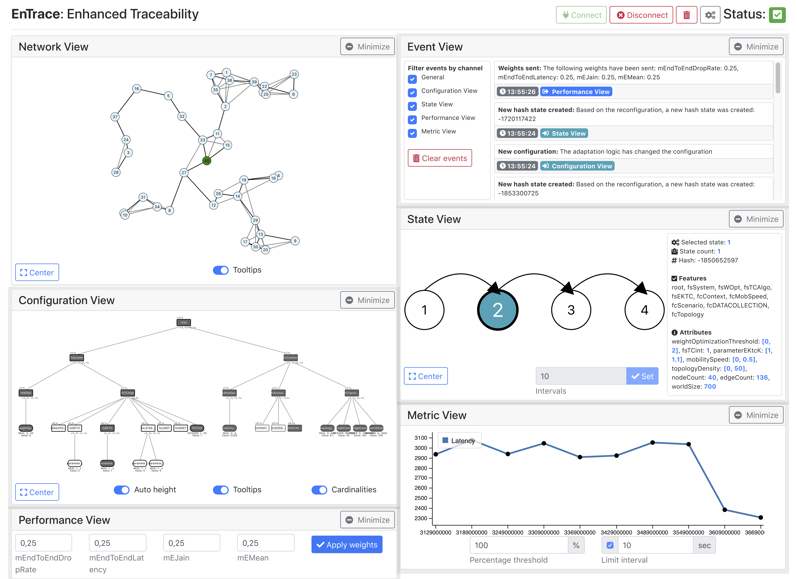

# EnTrace

This project is an improved and completely rewritten version of CoalaViz presented in the Paper [CoalaViz: Supporting Traceability of Adaptation Decisions in Pervasive Communication Systems](https://ieeexplore.ieee.org/abstract/document/8730818). CoalaViz was intended as addon for CoALa (Context-Aware DSPL-Based Planner, see [Optimal reconfiguration of dynamic software product lines based on performance-influence models](https://dl.acm.org/citation.cfm?id=3233030)). The initial development of EnTrace was done as part of a master thesis with the title *Enhanced Traceability in Adaptive Communication Systems* at University of Mannheim. EnTrace is presented in the submitted SeAC paper *EnTrace: Achieving Enhanced Traceability in Self-Aware Computing Systems*. 



## Quick Start

```bash
# Install dependencies
npm install

# 1st terminal
npm run broker

# 2nd terminal
npm run dev

# 3rd terminal
npm run demo
```

## Available Commands

``` bash
# Install dependencies
npm install

# Run a provided Node-based broker
npm run broker

# Serve with hot reload at localhost:8008
npm run dev

# Build for production with minification (see dist folder)
npm run build

# Run WSN-based demo publishing MQTT events on localhost
npm run demo
```

## Using the System

Currently, the system automatically connects to an MQTT broker on localhost via a websocket connection on port 8080. As a quickstart, you can start the provided Node-based MQTT broker by running `npm run broker`.

You can find a documentation of all available event types [here](event_types.md).

## Improving the System

Pull requests with any kind of improvement or addition are appreciated.

Some possible ideas and improvements:

- Adding a timeline so it is possible to jump back in time to an older state of the simulation
- Add possibility to show radii around nodes in topology view
- Add possibility to show a background image in topology view
- Add possibility to completely close view modules
- Add possibility to show the same view module twice with different content
- Migrate to Webpack 4
- ...

